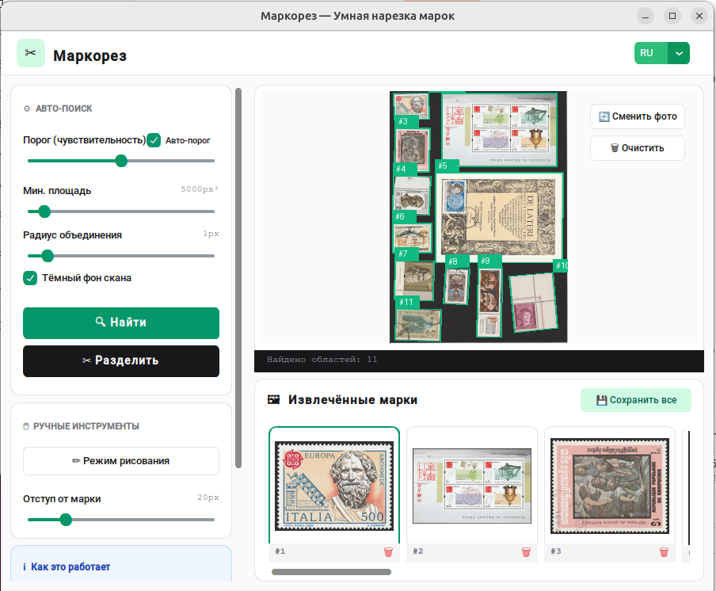

# ✂️ Маркорез

Умный инструмент для автоматического поиска и нарезки почтовых марок из сканов.


---
**Русская версия** | [English version](README_en.md)
---




## 📄 Описание

**Маркорез** — это десктопное приложение на Python, которое помогает филателистам автоматически находить и извлекать почтовые марки из отсканированных изображений. Программа использует компьютерное зрение (OpenCV) для обнаружения контуров марок и позволяет как автоматический, так и ручной выбор областей.

## ✨ Возможности

- **Автоматический поиск марок** — интеллектуальное обнаружение контуров с настраиваемыми параметрами
- **Интернационализация** — поддержка русского и английского языков
- **Ручной режим** — возможность вручную выделить пропущенные марки
- **Извлечение и сохранение** — автоматическая обрезка и экспорт в PNG/JPEG
- **Добавление подписей** — возможность добавить описания к каждой марке
- **Поддержка кириллицы** — работа с русскими путями и текстом

## 🛠️ Установка

### Требования

- Python 3.10+
- Windows (для полной функциональности)

### Шаги установки

1. Клонируйте репозиторий:
```bash
git clone https://github.com/your-username/markorez.git
cd markorez
```

2. Создайте виртуальное окружение:
```bash
python -m venv venv
source venv/Scripts/activate  # Windows
# source venv/bin/activate  # Linux/Mac
```

3. Установите зависимости:
```bash
pip install -r requirements.txt
```

4. Запустите приложение:
```bash
python main.py
```

## 🚀 Использование

1. Нажмите **"Выбрать файл"** для загрузки скана с марками
2. Настройте параметры поиска в левой панели:
   - Порог (threshold) — чувствительность обнаружения
   - Минимальная площадь — фильтр мелких объектов
3. Нажмите **"Найти и разделить"** для автоматического поиска
4. При необходимости используйте **"Режим рисования"** для ручного выделения
5. Нажмите **"Извлечь"** для обрезки найденных марок
6. Добавьте подписи (опционально) и сохраните результат

## 📂 Структура проекта

```
markorez/
├── main.py              # Главный файл приложения
├── editor_window.py    # Окно редактора марок
├── canvas_widget.py    # Виджет холста для рисования
├── image_utils.py      # Утилиты обработки изображений
├── constants.py        # Константы и настройки
├── requirements.txt    # Зависимости Python
├── build.bat          # Скрипт сборки в exe
└── Markorez.spec      # Спецификация PyInstaller
```

## 📦 Сборка в исполняемый файл

Для создания .exe файла выполните:
```bash
pip install pyinstaller
pyinstaller Markorez.spec
```

Или используйте готовый скрипт:
```bash
build.bat
```

## 📚 Зависимости

- `customtkinter` — современный GUI
- `opencv-python-headless` — обработка изображений
- `numpy` — числовые вычисления
- `Pillow` — работа с изображениями
- `pyinstaller` — создание исполняемых файлов

## 💬 Поддержка

По вопросам и предложениям: [@slaveaa](https://t.me/slaveaa)

## 📜 Лицензия

MIT License

## 👤 Автор

Маркорез
